# Chess Variant Game

## Table of Contents

[**Table of Contents**](#table-of-contents)

[**Starting The Game**](#starting-the-game)

[Downloading](#downloading)

[Local Play](#local-play)

[Online Play](#online-play)

[**Playing the Game**](#playing-the-game)

[Controls](#controls)

[Major Cards](#major-cards)

[Minor Cards](#minor-cards)

[Taking Your Turn](#taking-your-turn)

[How to play Chess](#how-to-play-chess)

[**Content**](#content)

[Major Cards](#major-cards-1)

[Minor Cards](#minor-cards-1)

[Pieces](#pieces)

[Pawn](#pawn)

[Rook](#rook)

[Knight](#knight)

[Bishop](#bishop)

[Queen](#queen)

[King](#king)

[Unique Pieces](#unique-pieces)

[Prawn](#prawn)

[Rock](#rock)

[Warp Bishop](#warp-bishop)

[Blockade](#blockade)

## Starting The Game

### Downloading

To start playing the game, you first need to download it. This can be found in the [releases](https://github.com/OwenTho/chess-variants-game/releases/) on GitHub or by following the instructions in the "How to build" in the [Read Me](README.md).

The data is stored in a .zip file, and therefore needs to be extracted.  
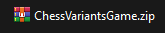  
Windows devices have extraction for this built in by right clicking and pressing "Extract All", or opening it and dragging the files out into a separate folder, but you can also use applications such as WinRAR or 7zip.

Upon extracting the game, you should have the following:  
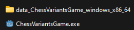  
A folder with the game .dll libraries, and the executable to run the game. The game needs both of these to function. The game can then easily be started by opening the executable file.

### Local Play

Local play is easy to start, only requiring you to press "Play Offline Game" in the middle of the screen.  
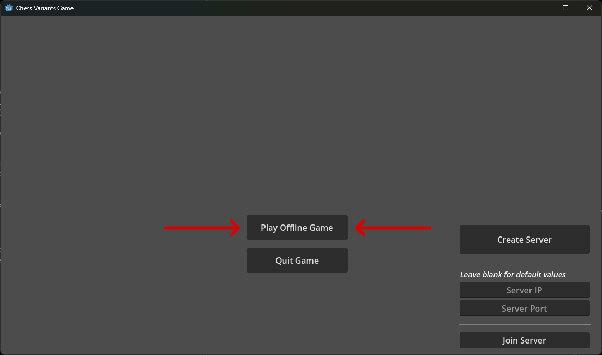  
In Local Play, both players need to use the same device. You can see who's turn it currently is by if this arrow is being displayed next to the player's info display. Player 1 is White, and Player 2 is Black.  
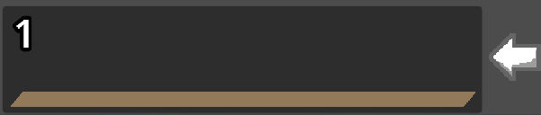  

### Online Play

Online play is slightly more complex. There is no available public server, so you will either need to port forward, or create a tunnel to allow another player to connect to your game.

There is an explanation on how to set up a network tunnel using [https://playit.gg](https://playit.gg) in "[How to play Online](HowToPlayOnline.md)".

Another way is to set up a server if you know how to open a port. Running the executable with the "--dedicated\_server" argument will open a server directly on starting, with the first player who joins the server being given control over starting the game, and which player is which team.

You can start or join an Online game with these two buttons:  
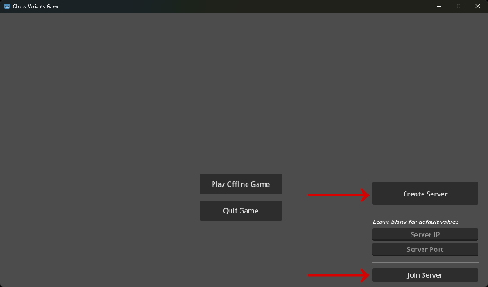  
You will need to set the Server IP and Server Port if joining, whereas only the Server Port matters if creating the server.  
By default, the Server Port used is 9813\. *If using playit.gg for a tunnel, remember to use the public playit.gg port to join, not the local port set in the game.*

Similarly to Local Play, Online Play displays who the current player is using an arrow. However, it also displays the name of the player that they set in the server lobby before the game starts:  

## Playing the Game

### Controls

Left Mouse Button \- Select  
Right Mouse Button \- Rotate Board

### Major Cards

The first thing that happens for each player when you start a game is being shown 3 Major Cards.  
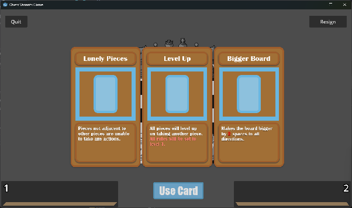  
Each Major Card impacts the game in different ways, making the experience slightly different each time. There are currently 7 different cards, and 2 cards will be used per game as each player is required to select and use one of them.

### Minor Cards

Minor Cards make smaller changes to the game, to individual pieces. These are given as the game progresses. Every turn a player takes gets them closer to obtaining a Minor Card. You can see how close a player is to getting their next Minor Card with the yellow bar at the bottom of their info display.  
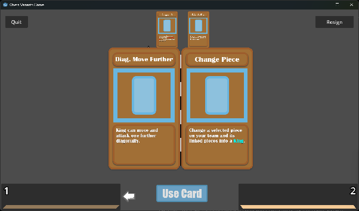  
However, it's important to know that taking your enemy's pieces will put them much closer to getting their next card.

### Taking Your Turn

When it is your turn in the game, the first thing you will need to do is select a piece. When hovering your mouse over the board, you should be able to see this red highlight:  
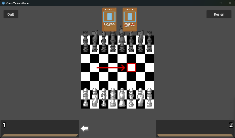

If you can see this highlight, it means that the game is registering your mouse hovering over the space. If you hover a piece and click the Left Mouse Button, you will select the piece:  
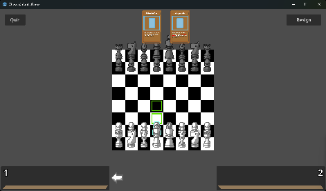

The piece will show an outline showing it is selected. In addition to that, green highlights will appear to show you what actions you can take. These actions can then be taken by clicking on a cell with a green highlight:  
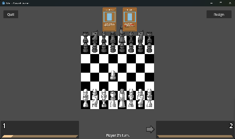  
After the action is finished (including piece promotion if it occurs), the turn will swap over to the next player.

### How to play Chess

The basic rules of chess are below:

- The "King Piece" cannot be taken, and is instead put into "Check" when targeted by an attack.  
- If your "King Piece" is in "Check", then you must remove it from "Check" either by moving the "King Piece", or by moving another piece to protect it.  
- If it is not possible to take the "King Piece" out of "Check", then that player is in "Checkmate" and loses the game. This is checked automatically, so if the game does not end then there is a possible move to escape Checkmate.  
- If it is not possible for a player to take their turn, as there are no valid actions for them to take AND their "King Piece" is not in "Check", then the game results in a "Stalemate" as it isn't possible for the game to continue. Neither player wins in this instance.  
- A player can resign from the game, which immediately makes them lose the game. *There is no confirmation, so be careful to not press the button by accident.*

In addition to the above rules, there are a few more to take into account:

- If a player does not have a "King Piece", they lose the game. Losing your "King Piece" is not considered being put into "Check", and therefore is not prevented.  
- The "King Piece" can be a piece other than the King. For example, the "Pawn Army" card changes the "King Piece" into the Pawn.  
- When there is more than one "King Piece", they are treated as normal pieces. Only when there is one "King Piece" left is it able to be put into "Check".  
- The "King Piece" is unable to move through "Check". This means that the "King Piece" can still be trapped.

## Content

### Major Cards

- **Bigger Board** : Makes the board bigger by 2 spaces in all directions.  
- **Friendly Fire** : Pieces are able to attack pieces on their own team.  
- **Level Up** : Pieces have all their actions immediately set to level 1, and have them increase with each Piece taken after.  
- **Lonely Pieces** : Pieces are unable to take any actions if they are not directly adjacent to another piece.  
- **Pawn Army** : Immediately changes all of the pieces on the board into Pawns.  
- **Shapeshift** : Whenever a piece takes another piece, the attacking piece will change into the piece it takes.  
- **Shuffle** : Immediately shuffles the pieces on the board amongst team pieces. The shuffle will be mirrored for both teams.

### Minor Cards

The following are the available *rule* cards.

- **Promotion** : Allows promotion of a piece into a *different* piece once the piece reaches the end of the board. This works for all pieces.  
- **Move Further** : Allows the piece to move further horizontally and vertically, in addition to attacking the space.  
- **Diag. Move Further** : Allows the piece to move further diagonally, in addition to attacking the space.  
- **Nothing** : Allows a piece to do nothing. This means that it can spend the turn without moving.

### Pieces

For the pieces, there are a couple things to know about in advance. The action cells are displayed, showing the distance each piece can move initially. In addition, attacks that aren't displayed are shown via a red arrow.  
If an action path isn't obvious, it will be shown with green arrows.  
Finally, the levels of actions are shown, with the initial level shown in blue.

#### Pawn

Initially, the Pawn is able to move one space forward, an extra space on its first turn and is able to attack diagonally forward one space. When levelling, the distance on forward movement and diagonal movement increases.

*Forward direction does not go to 2 spaces with the "Move Further" card, as it's move \+ attack, while Pawn's forward movement is only movement.*

*(En passant is also implemented)*

First Turn (Initial forward movement):  
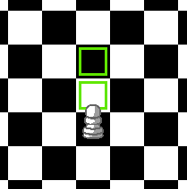  
Following Turns:  
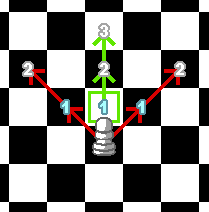

#### Rook

Able to move and attack horizontally and vertically, initially 7 spaces. It is able to travel further as it levels up.  
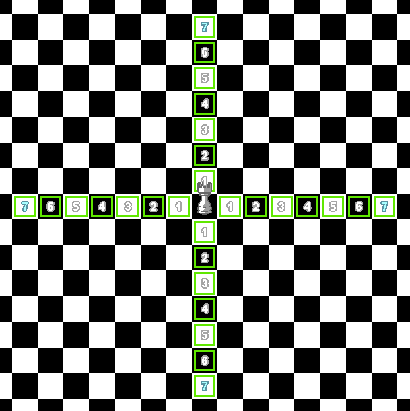

#### Knight

Initially jumps and attacks positions in an L-shape away from it. When levelling up, jumps take a zig-zag pattern diagonally. In addition, every 4 levels an additional, closer jump will appear.  
Initial:  
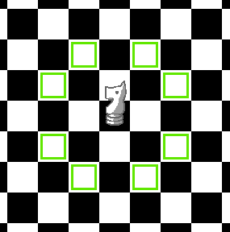  
With paths and levels:  
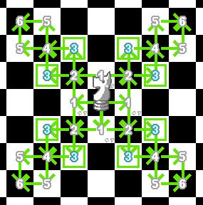

#### Bishop

Able to move and attack diagonally, initially 7 spaces. As its level increases, it is able to move further.  
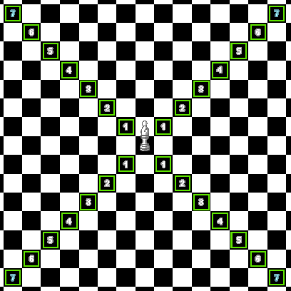

#### Queen

Able to move and attack in all 8 directions, initially 7 spaces. As its level increases, it is able to move further.  
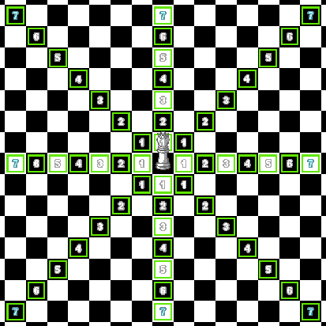

#### King

Able to move and attack the 8 spaces surrounding it. In addition to that, as its level increases it can move further horizontally and vertically similarly to a Rook.  
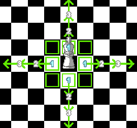

### Unique Pieces

#### Prawn

A piece that flips between horizontal/vertical and diagonal actions for movement and attacks every time it moves. Initially, it goes 2 spaces.  
*The movement is based on how many times the piece has turned, so it may start diagonally if the piece has moved before.*  
Initial Turn:  
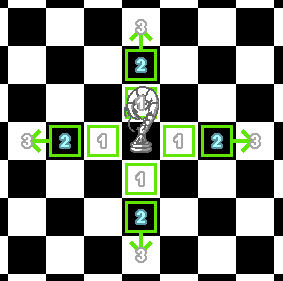  
Alternate Turns:  
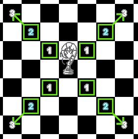

#### Rock

A piece that can do nothing initially.  
*(This means the piece can use your turn with no actions being done that affect the game)*  
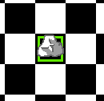

#### Warp Bishop

A piece that can move like a Rook, ignoring other pieces, and is capable of attacking pieces 2 spaces away diagonally.  
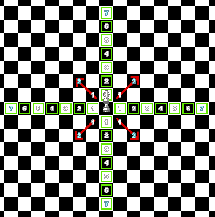

#### Blockade

A piece that can initially only move left and right 2 spaces. It is invincible to other pieces, but can not attack any other pieces itself.  
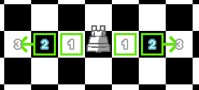