# How to play online

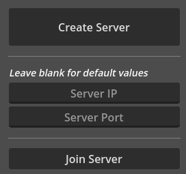  
Default Server IP: 127.0.0.1  
Default Server Port: 9813

## How to play using a playit.gg tunnel

1. Make an account for [https://playit.gg](https://playit.gg/).

2. Press "Set up a new agent", or go to [https://playit.gg/setup/agent](https://playit.gg/setup/agent).

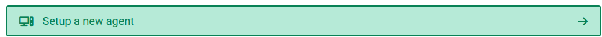

3. Download ([https://playit.gg/download](https://playit.gg/download)) the program.

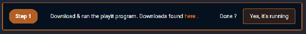

4. Run the program, and go to the link the program provides (or go to [https://playit.gg/claim](https://playit.gg/claim) and input the code manually). The link provided should look similar to this:

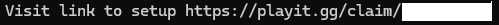

5. Wait for the program to connect. Once it connects, it should look similar to this:

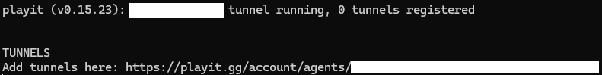

6. Open up the link provided and press "Add Tunnel" under the "Tunnels" tab.

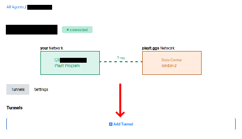

7. In "Tunnel Type", select "UDP (protocol)". It *must* be UDP as the game uses UDP to communicate. If a warning regarding malware pops up, press the button stating you will not host malware:

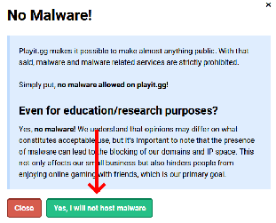  
Then, once you have "UDP (protocol)" selected, you need to set the Local Port. This can either be the default port for the game (9813), or you can set it between the range 1025 \- 49151 (if not between that range it will use the default 9813).

Only you will use this, and it won't be shared with whoever you're playing with, so the default 9813 is best as you do not have to re-input it every time.

If you leave it blank, you'll need to use the automatically assigned Shared Port. *This may change between uses, so it's recommended to set it manually.*  
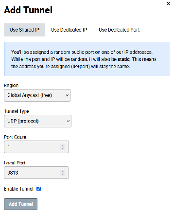

8. If you do not remember the Local Port after the previous menu, you can view or set it below the usage graph in the "Update Local Address" section *(image below)*. Leave "Local Address" as 127.0.0.1, as that is an address that refers to your own device. But you must set the Local Port to whatever you (the server) plan to use.

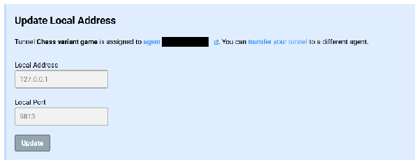

9. Now that the tunnel is set up, enable it. You will need to share the IP and port with the person you plan to play with. They must use this IP and Port:

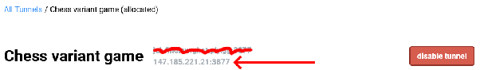  
Note that you must use the number IP as the game does not support domain IPs.

10. Finally, before the other player can join, you must create the server. Remember to use the port you set for yourself in Local Port. *You* (the server) must use the *Local* IP and Port that you set, while instead giving the *Shared* IP and Port to the person joining (the clients).

You (Server):  
Local IP (default 127.0.0.1)  
Local Port (default 9813\)  
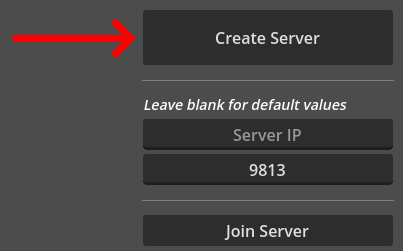  
The other player (Client):  
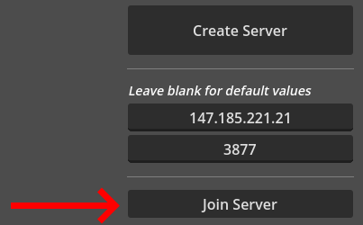  
***If it does not work, you may need to restart the tunnel program running on your device.***

When in game's server lobby, you (the server admin) can give yourself a name, define who is Player 1 (white) and who is Player 2 (black) and start the game:  
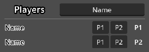  
Although not displayed visually, you can set one player to be P1 and P2, and they will be able to play the game against themselves (as if it were a local game).
